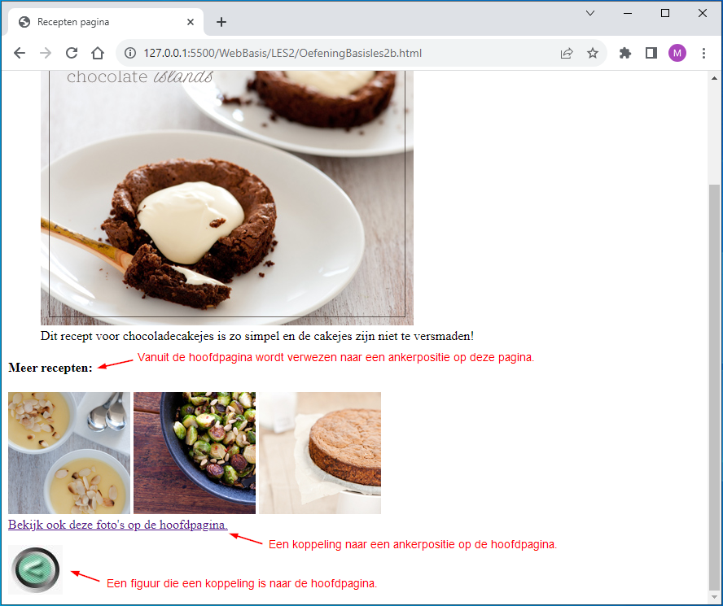

# Opgave

## Pagina1

## Pagina2

# Oplossing
- https://uc-leuvenlimburg.github.io/Webdevelopment-23-24/WebBasis/LES2/OefeningBasisles2a.html
- https://uc-leuvenlimburg.github.io/Webdevelopment-23-24/WebBasis/LES2/OefeningBasisles2b.html