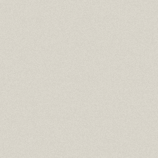

# Opgave

## HTML

- Via de website http://www.lipsum.com/ kunnen 9 paragrafen tekst gegenereerd worden.
- De 9 paragrafen worden in de body van een nieuw HTML bestand geplakt. De nodige < p > tags worden toegevoegd.
- Bovenaan komt nog een hoofdtitel en daaronder een subtitel. Ook na 4 en na 8 paragrafen komt een subtitel.
- Paragraaf 2, 3 en 4 worden gegroepeerd in een div met klasse "inspringen".
- Paragraaf 6, 7 en 8 worden gegroepeerd in een div.
- De eerste paragraaf krijgt de klasse "intro".
- De eerste en de 5e paragraaf krijgen de klasse "inspringen".
- De laatste subtitel en de laatste paragraaf krijgen de klasse "besluit". 
- Helemaal onderaan komt een koppeling die terug naar de hoofdtitel van het bestand gaat. 
- Ook de hoofdtitel is een koppeling, deze gaat naar de koppeling aan de onderkant van het bestand. 

## CSS

### Algemeen:
- Het geheel heeft een volle achtergrondkleur en in het midden van boven tot beneden wordt een achtergrond afbeelding (backdrop.gif) gebruikt. 
- Alle tekst heeft een volle voorgrond kleur (color - niet standaard zwart).  
- Alle tekst is in een serif lettertype, terwijl de titels een sans-serif lettertype hebben. 

### Titels + koppelingen:
- De subtitels zijn 1,5 maal de standaard lettergrootte en de hoofdtitel is 2 maal de standaard lettergrootte. 
- Omdat de hoofdtitel ook een koppeling is, zorgen we dat de koppelingen geen onderlijning hebben. (Ook de koppeling onderaan verliest zijn onderlijning. Volgende les leren we hoe je enkel de eigenschappen van een koppeling in een hoofdtitel kan aanpassen.)
- Geef de hoofdtitel een donkere achtergrondkleur en een lichte voorgrondkleur. (Ook hier zal je de kleur van de koppelingen moeten aanpassen. De kleur geldt dus ook weer voor beide koppelingen.)
- Pas de koppeling onderaan (gebruik zijn id) terug aan naar een donkere voorgrondkleur en een lichte transparante achtergrondkleur. 
- De titels worden gecentreerd.
- Geef de hoofdtitel een schaduw. 

### Andere tekst:
- Tekst binnen een div wordt schuin gedrukt.
- De eerste paragraaf wordt vet gedrukt.
- De laatste paragraaf wordt gewijzigd in hoofdletters met de grootte van het standaard letterype. 
- Laat de eerste regel voor alle paragrafen met de klasse inspringen, of de paragrafen binnen een div met de klasse inspringen, 20 pixels inspringen. 
- Maak hoofdletters van de tekst van de paragrafen met de klasse inspringen (Dit geldt niet voor de paragrafen binnen de div met de klasse inspringen.)

