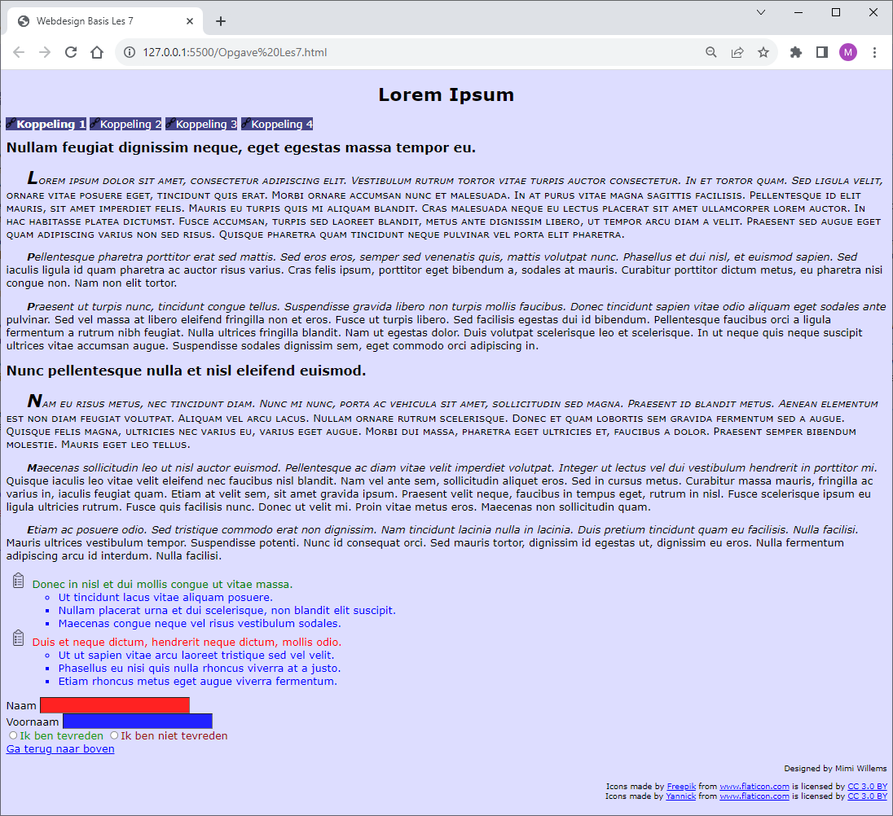

# Opgave

We vertrekken voor deze opgave van de oefening les 7 van de Webdesign basis.

Elke studenten oplossing is verschillend en uniek. Vertoont geen duidelijke overeenkomsten met voorbeeldoplossingen. Kies dus ook zo veel mogelijk je eigen kleuren en waardes waar mogelijk.

Dit is een oefening op allerlei verschillende selectoren. Het is dus ook de bedoeling dat je geen klasse of id toevoegt aan je HTML. Ook in je CSS-code gebruik je geen enkele id of klasse selector. 

## Breid de opgave als volgt uit:

### Navigatie: 

- Maak de eerste koppeling uit de navigatie vet gedrukt.
- Plaats een icoontje (link.png) voor elke koppeling van de navigatie. 

### Paragrafen:

- Maak van de eerste paragraaf na een hoofdtitel drukletters de grootte van standaard letters. 
- Maak de eerste letter van de paragraaf na een hoofdtitel 1.75 keer groter dan het standaard lettertype. 
- Maak de eerste regel van alle paragrafen die op hetzelfde niveau staan als een hoofdtitel schuin gedrukt.
- Maak de eerste letter van de paragrafen rechtstreeks in de body vet gedrukt.

### Lijst:

- Geef het eerste sublijst item een bolletje.
- Maak het hoofdlijst-item dat na een ander hoofdlijst item komt rood. (Sublijst items blijven blauw, omdat de regel voor het blauw maken meer specifiek is.)