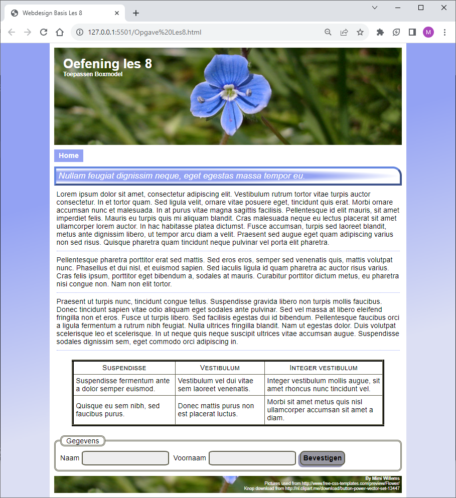

# Opgave

We vertrekken voor deze opgave van de oefening les 8 van de Webdesign basis.

Elke studenten oplossing is verschillend en uniek. Vertoont geen duidelijke overeenkomsten met voorbeeldoplossingen. Kies dus ook zo veel mogelijk je eigen kleuren en waardes waar mogelijk.

Het is ook deze keer weer de bedoeling dat je geen klasse of id toevoegt aan je HTML. 

## Breid de opgave als volgt uit:

### De body

- Wijzig de achtergrond van de body naar een kleurenverloop, die niet standaard van boven naar beneden verloop. Gebruik minimum 2 kleuren, maar deze kleuren zijn op de uiteinden minstens 20% volledig aanwezig. 
- Wanneer een browser het kleurverloop niet ondersteund, wordt de volle achtergrondkleur behouden. 

### De navigatie

- Zorg ervoor dat de eerste koppeling altijd zichtbaar is, terwijl de andere koppelingen volledig transparant blijven.
- Zorg ervoor dat wanneer we over de navigatie bewegen de andere lijstitems langzaam verschijnen (Tip: gebruik een transition voor opacity).
- Zorg ervoor dat deze overgang werkt in beide richtingen. Dus de koppelingen verdwijnen ook weer langzaam wanneer de muiscursor de navigatie verlaat (Tip: transition staat niet bij de :hover). 
- Wanneer over een koppeling bewogen wordt gaat dit schommelen. (Tip: Maak een animatie en pas deze toe bij :hover) Hiervoor is het wel nodig om de koppeling de eigenschap display:inline-block; mee te geven. (hierover meer in de volgende basis-les).

### De titel in de content

- Krijgt een cirkelvorm kleurverloop, waarvan het middelpunt niet exact in het midden staat. (Wordt het kleurverloop niet ondersteund door de browser dan blijft de volle achtergrondkleur behouden.)
- Maak je groter (scale) wanneer je erover beweegt.
- Doe dit geleidelijk (transition).
- De titel wordt ook geleidelijk kleiner wanneer de muisaanwijzer de titel verlaat (transition weer niet bij :hover).

### De tabel

- Maak enkelvoudige lijnen tussen de cellen in de tabel (collapse).
- Zorg dat de wijziging van de achtergrondkleur iets geleidelijker gebeurt (zowel bij opkomen als verdwijnen).

### Het formulier

- Wanneer er met de muis over een invoerveld bewogen wordt, wordt de achtergrond donkerder. Gebruik voor de browsers die het ondersteunen een kleurverloop. 
- Wanneer de cursor in het invoerveld staat geef je het invoerveld een schaduw aan de binnenkant.
- Geef de knop een schaduw links onderaan. 
- Laat wanneer op de knop geklikt wordt, de knop een beetje naar links onder bewegen. 
- Maak hierbij ook de schaduw evenveel kleiner zodat het lijkt alsof de knop ingedrukt wordt. 

