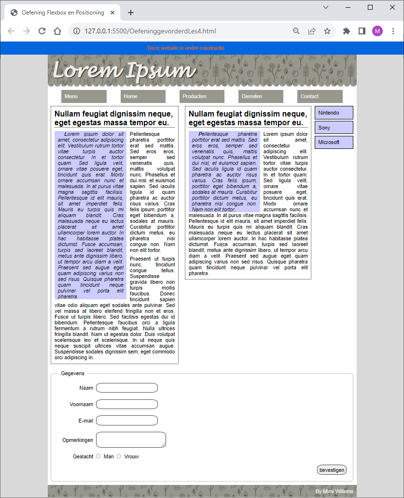
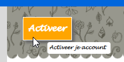
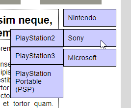

# Opgave

We vertrekken voor deze opgave van de oefening les 9 van de Webdesign basis.

Elke studenten oplossing is verschillend en uniek. Vertoont geen duidelijke overeenkomsten met voorbeeldoplossingen. Kies dus ook zo veel mogelijk je eigen kleuren en waardes waar mogelijk.

Het is ook deze keer weer de bedoeling dat je geen klasse of id toevoegt aan je HTML. 

## Breid de opgave als volgt uit:

### Paragraaf rechtstreeks in de body

- Geef de span in de paragraaf rechtstreeks in de body een relatieve positionering. 
- Maak een animatie zodat de tekst (span) telkens van links naar rechts loopt, door de eigenschap left aan te passen. 

### De header

#### De titel in de header

- Wanneer over de titel bewogen wordt, wordt deze een vast aantal pixels (vb. 500pixel) naar rechts verplaatst in 0.5s. (Probeer voor de oefening gebruik te maken van positioning absolute, maar een margin zou ook kunnen. Om de absolute positionering te gebruiken moet de positionering van de header verschillende van static.)

#### De div in de header

- De div in de header wordt uit het normale verloop gehaald en op 20pixel van de bovenkant van de header en op 30pixel van de linkerkant van de header geplaatst. (Ook hiervoor moet de positionering van de header verschillen van static).
- Geef de div een padding en een border. 
- Geef de div een opvallende achtergrond kleur en een goed contrasterende voorgrondkleur. 
- Geef de div een schaduw.
- Wanneer over de header bewogen wordt, is de div geleidelijk (in 0.5sec) zichtbaar (Tip: opacity). 
- Wanneer op de div geklikt wordt, wordt deze een beetje verplaatst. Zorg dat de schaduw blijft staan door deze kleiner te maken. 

#### De uitleg bij de div: (zie voorbeeld tooltip)

- Behandel deze uitleg zoals de tooltip in het voorbeeld: Geef een achtergrondkleur, afgeronde hoeken, kleinere letters, een breedte,...
- Plaats de uitleg midden onder de div.
- Wanneer over de div bewogen wordt, wordt de uitleg in 0.5sec zichtbaar. 
- Zorg ervoor dat bij klikken deze uitleg niet mee verplaatst wordt (door deze dan in de tegenovergestelde richting te bewegen).

### De content

- Geef de content een breedte van 830 pixel om plaats te maken voor de side navigatie.

### Artikel: De eerste paragraaf na een titel

- Maak de eerste paragraaf na een titel zwevend links met een breedte van 60% van het artikel.
- Geef deze paragraaf een achtergrondkleur. 
- Geef de tekst van deze paragraaf links en rechts 10pixel ruimte tov de achtergrondkleur. 
- Geef rechts naast deze achtergrond kleur ook een ruimte van 10pixel voor de rest van de inhoud. 
- Maak de tekst schuin gedrukt. 
- Maak de eerste letter vet gedrukt. 
- Laat de eerste regel nog eens 20 pixel inspringen. 

### De side navigatie (zie voorbeeld verticaal uitklapmenu)

- De side navigatie wordt uit het normale verloop gehaald en op 10 pixels van rechts en op 10pixel van boven binnen de content-container gesplaatst (de position van de content-container verschilt dus van static).
- Lijstitems en koppelingen vertonen geen item markers, onderlijning en de tekst is zwart.
- Elk lijst item gebruikt een volle achtergrond kleur en heeft een 1pixel dikke zwarte omlijning.
- De tekst van het item staat op 10 pixel van de rand.
- Een list-item is 120pixel breed.
- De sublijst items worden enkele getoond wanneer over het hoofdlijst item bewogen wordt.
- De sublijst items beginnen links tegen en op de zelfde hoogte als het hoofdlijstitem. (Hier moet je ondanks de box-sizing toch nog rekening houden met de borders.)
- Hoofdlijst items staan op 5 pixel van elkaar, sublijst items staan tegen elkaar.

### Het formulier

- In de basis gaven we de labels een breedte van 120pixel en werden deze rechts uitgelijnd. We willen echter niet dat dit ook toegepast wordt voor de labels van de radiobuttons. Daarom passen we deze regel enkel toe voor het eerste label binnen een div. 
- De inhoud van de laatste div (de submit knop) wordt (flexibel) rechts geplaatst. 
